# Volt Vision Copilot Architecture Diagram

Volt Vision Copilot is a patent-inspired educational prototype for local,
human-in-the-loop CNC power-cycle investigation. It screens synthetic demo
cycles or uploaded single-cycle CSV inputs, records only structured local demo
events after explicit user action, and provides bounded investigation guidance
for manual review.

## Public Architecture Diagram

```mermaid
flowchart LR
    subgraph Inputs["Inputs"]
        CalibrationInputs["Known-good calibration cycles"]
        CandidateInput["Candidate cycle<br/>synthetic demo or uploaded single-cycle CSV"]
    end

    subgraph Monitor["Deterministic monitoring engine"]
        Reference["Reference template<br/>medoid selection"]
        Threshold["Calibrated DTW threshold"]
        DTW["DTW comparison<br/>against reference template"]
        Distance["DTW distance"]
        DecisionLogic["Deterministic status decision<br/>distance compared with threshold"]
        Event["MonitoringEvent<br/>status + metrics"]
    end

    subgraph NormalPath["Stable normal path"]
        Normal["within_normal_band"]
        Continue["Continue monitoring"]
        NoCopilot["No Copilot investigation"]
        NoPersistence["No explicit event persistence required"]
    end

    subgraph Persistence["Local-only demo persistence"]
        Suspected["suspected_deviation"]
        SaveGate["Explicit local event save"]
        EventHistory["Local event history<br/>structured metrics only"]
        FeedbackHistory["Local feedback history"]
    end

    subgraph Evidence["Local MCP evidence layer (read-only)"]
        CuratedDocs["Local curated guidance / SOP documents"]
        Metrics["Event metrics"]
        Guidance["Curated maintenance guidance"]
        Similar["Similar local events"]
    end

    subgraph Copilot["Optional ADK Copilot"]
        ModelGuidance["Model-assisted guidance<br/>when locally configured"]
        Fallback["Deterministic fallback<br/>when model assistance is unavailable or rejected"]
        BoundedOutput["Bounded inspection questions<br/>manual inspection recommended"]
    end

    subgraph Human["Human review"]
        Ack["Human review acknowledgement"]
        Decision["Human users decide<br/>any real-world action"]
    end

    SafetyNote["Safety note:<br/>Local feedback does not update calibration,<br/>thresholds, detection status, or MonitoringEvent."]

    CalibrationInputs --> Reference
    Reference --> Threshold
    Reference --> DTW
    CandidateInput --> DTW
    DTW --> Distance
    Distance --> DecisionLogic
    Threshold --> DecisionLogic
    DecisionLogic --> Event

    Event --> Normal
    Normal --> Continue
    Continue --> NoCopilot
    NoCopilot --> NoPersistence

    Event --> Suspected
    Suspected --> SaveGate
    SaveGate --> EventHistory

    EventHistory --> Metrics
    EventHistory --> Similar
    CuratedDocs --> Guidance

    Metrics --> ModelGuidance
    Guidance --> ModelGuidance
    Similar --> ModelGuidance

    Metrics --> Fallback
    Guidance --> Fallback
    Similar --> Fallback

    ModelGuidance --> BoundedOutput
    Fallback --> BoundedOutput
    BoundedOutput --> Ack
    Ack --> FeedbackHistory
    Ack --> Decision
```

## Component Descriptions

- **Inputs:** Known-good calibration cycles build the reference template and
  calibrated DTW threshold. A separate candidate cycle, either from the
  synthetic demo or an uploaded single-cycle CSV, is compared against that
  reference. CSV data is validated before monitoring, and raw traces are not
  sent to a model.
- **Deterministic monitoring engine:** Calibration, DTW comparison, calibrated
  thresholding, and `MonitoringEvent` creation are deterministic. This engine is
  the only authority for `within_normal_band` or `suspected_deviation`.
- **Stable normal path:** A `within_normal_band` event means continue
  monitoring. Copilot investigation is unavailable, and explicit event
  persistence is not required.
- **Explicit local event save:** A suspected deviation is not persisted
  automatically. The user must explicitly save the structured event before
  investigation is available.
- **Local MCP evidence layer (read-only):** Investigation uses local event
  metrics, curated maintenance guidance, and similar local events. These
  evidence sources are read-only for the Copilot workflow.
- **Optional ADK Copilot:** When configured locally and accepted by safety
  checks, Copilot may provide model-assisted guidance. If model assistance is
  unavailable or rejected, deterministic fallback guidance is used instead.
- **Human review and feedback:** Guidance requires human review acknowledgement
  before feedback can be recorded. Feedback is local history only.

## Current Public Demo Scope

- The stable synthetic workflow is the public end-to-end demo.
- CSV validation and deterministic screening are included.
- The CSV saved-event-to-Copilot continuation is not presented as a completed
  public workflow.

## Responsibility Boundaries

- Deterministic monitoring is the only authority for
  `within_normal_band` / `suspected_deviation`.
- Copilot may explain saved structured evidence and propose bounded inspection
  questions only.
- Copilot must not diagnose a confirmed fault, confirmed tool wear, confirmed
  root cause, or real-world action.
- Human users decide any real-world action after manual inspection.
- Feedback must not update calibration, thresholds, detection status, or the
  saved `MonitoringEvent`.

## Security and Safety Notes

- The prototype has no direct equipment integration.
- Demo persistence is local-only and stores structured event summaries rather
  than external customer data or internal execution traces.
- Secrets, credentials, provider-specific model names, raw prompts, runtime
  details, and internal tool payloads are excluded from public-facing
  documentation.
- Public wording should remain conservative: suspected deviation, manual
  inspection before action, and guidance for human review.
- The project is a patent-inspired educational prototype, not an industrially
  validated diagnosis or control system.

## Diagram Use

This Mermaid diagram can be reused as the public architecture reference in the
README, Kaggle Writeup, Treasure Hunting presentation, and demo documentation.
For slide or video use, render the Mermaid source with an existing trusted tool
outside the repo workflow, then keep the same safety boundaries and conservative
wording intact.
